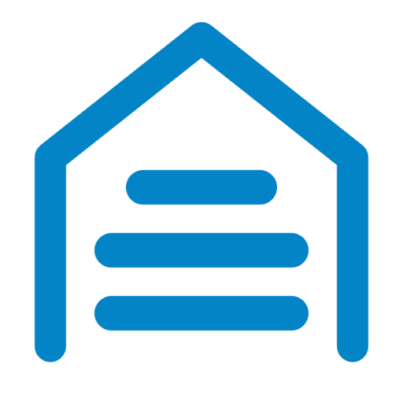
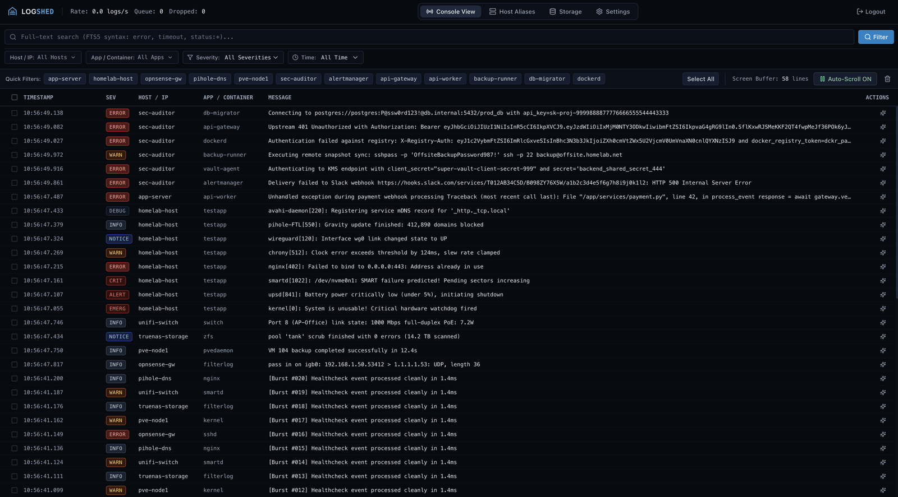
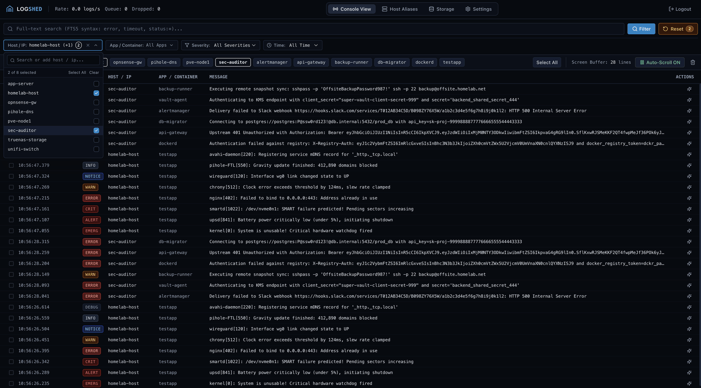
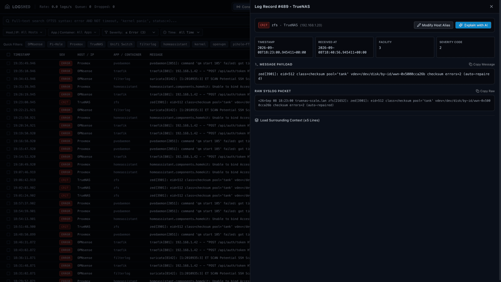
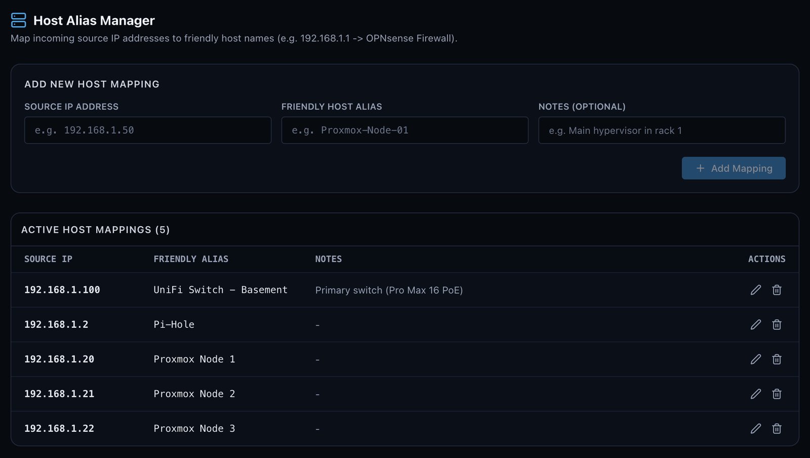
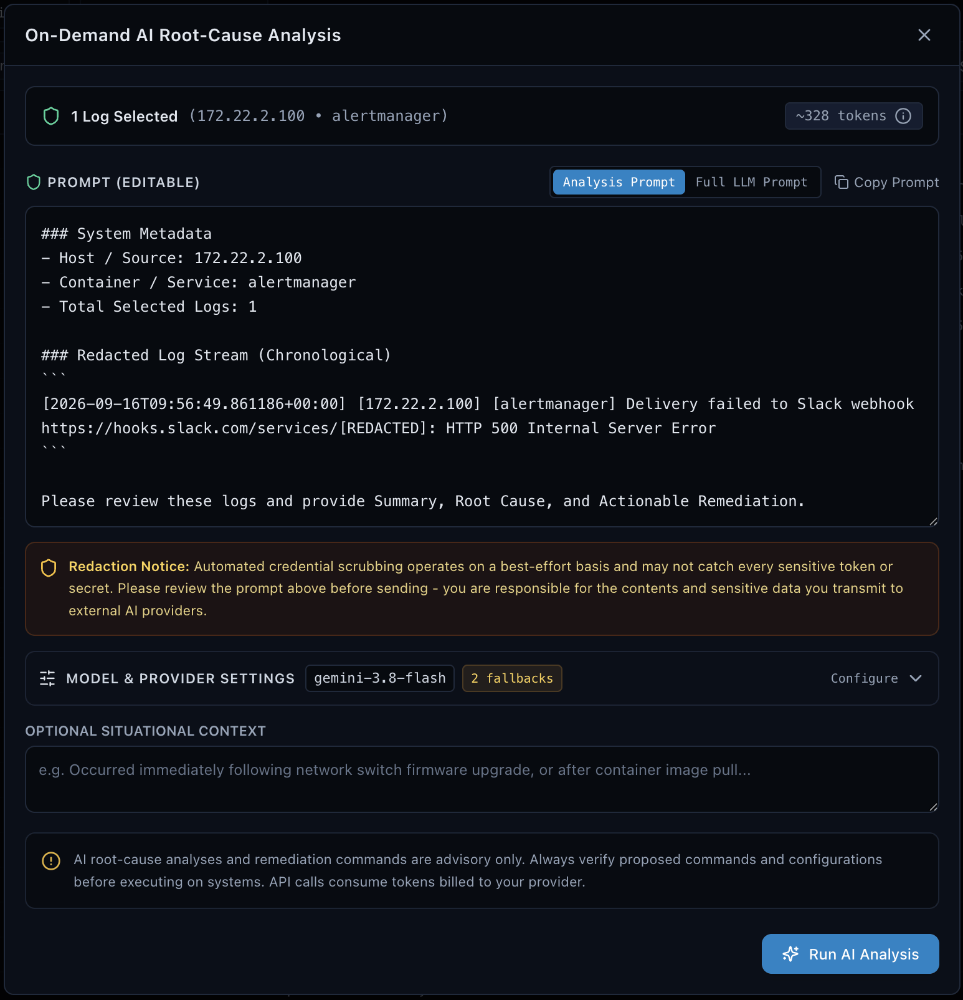
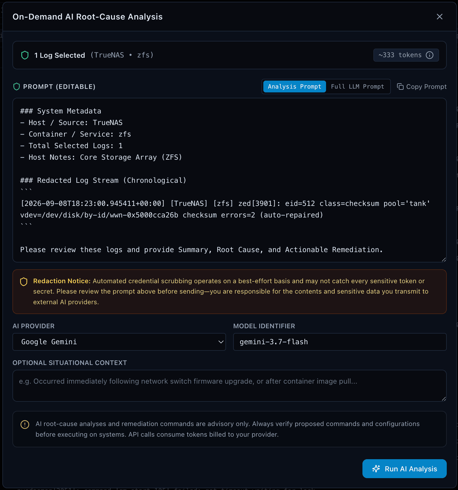
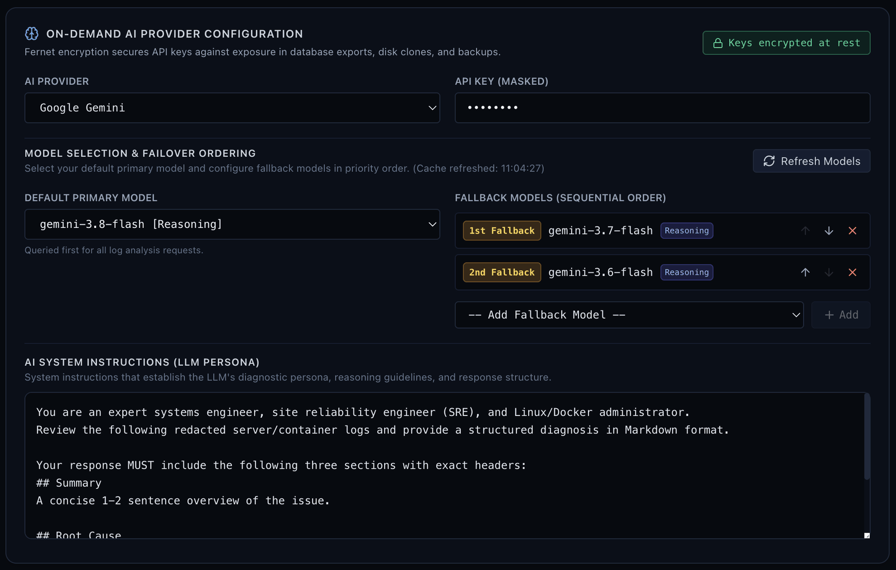
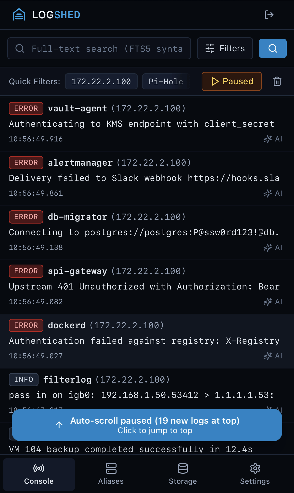

<p align="center">
  
</p>

<h1 align="center">LogShed</h1>

<p align="center">
  <strong>A lightweight, self-hosted homelab log aggregator and syslog server featuring real-time streaming, fast SQLite FTS5 search, and user-directed AI incident analysis.</strong>
</p>

<p align="center">
  <a href="https://github.com/BenHornerTech/logshed"></a>
  <a href="LICENSE"></a>
  <a href="https://github.com/BenHornerTech/logshed/pkgs/container/logshed"></a>
  <a href="#prerequisites--system-requirements"></a>
  <a href="#built-with"></a>
  <a href="#built-with"></a>
  <a href="#built-with"></a>
  <a href="#built-with"></a>
</p>

---

## Table of Contents

- [Overview](#overview)
- [Features](#features)
- [Screenshots](#screenshots)
- [Built With](#built-with)
- [Prerequisites & System Requirements](#prerequisites--system-requirements)
- [Installation & Deployment](#installation--deployment)
 - [Docker Compose](#docker-compose-recommended)
 - [Unraid Setup](#unraid-installation)
 - [Docker Run](#generic-docker-run)
 - [Initial Setup](#initial-setup--authentication)
- [Configuration Reference](#configuration-reference)
 - [Environment Variables](#environment-variables)
 - [Runtime Settings (Web UI)](#runtime-settings-web-ui)
 - [Data Persistence & Storage Paths](#data-persistence--storage-paths)
 - [Internal Diagnostic Logging](#internal-diagnostic-logging)
 - [Secret Redaction & Raw Log Fidelity](#secret-redaction--raw-log-fidelity)
- [AI Incident Diagnosis](#ai-incident-diagnosis)
- [Local Development](#local-development)
- [Licensing](#licensing)

---

## Overview

Most logging stacks (such as Grafana Loki or the ELK stack) target large production clusters. Running them on a home server often takes several gigabytes of RAM and significant setup time just to collect logs from a router, a couple of virtual machines, and a handful of containers.

LogShed is a compact, self-hosted log hub designed for home labs and personal servers. It ingests standard syslog traffic and Docker container output into a single local SQLite database with full-text search (FTS5), providing a quick search interface and optional AI error diagnosis when you need help reading a stack trace.

> [!NOTE]
> LogShed is intended for home networks and personal self-hosted environments. It is not built for multi-tenant companies or high-throughput enterprise infrastructure. It started as a personal tool and is shared here in case others find it helpful.

---

## Features

- **Single container, single process**: The main thread runs FastAPI and monitored async workers. There is no separate database process, Redis instance, or message broker to run or maintain.
- **Low memory usage**: Idles at roughly 150 MB to 250 MB of RAM under normal home lab traffic.
- **Dual ingestion**:
 - **Syslog**: Listens on port 1514 (UDP and TCP) for RFC 3164 and RFC 5424 formats, supporting both octet-counted and newline-delimited TCP framing.
 - **Docker Engine API**: Tails local containers via `/var/run/docker.sock` or remote hosts via TCP proxy without extra dependencies.
- **Multiline stream assembly**: Groups multi-line exceptions (such as Python tracebacks or Java stack traces) by source stream within a short buffer window so related lines stay together.
- **Full-text search (SQLite FTS5)**: Fast prefix search across hosts, container names, log content, and severity tags.
- **Optional AI diagnosis**: Select log rows in the web UI to request an explanation and suggested fixes from Google Gemini, OpenAI, or a local model (Ollama / vLLM). API requests are strictly manual, and sensitive values (passwords, tokens, keys) are stripped before dispatch.
- **Host aliases**: Map IP addresses to friendly names (for example, `192.168.1.1` to `router`), which automatically apply across existing records.
- **Automatic retention**: Purges older logs in the background on a schedule (default: 14 days) and reclaims SQLite storage space without taking the database offline.
- **Security**: Runs as a non-root user (`PUID`/`PGID`), hashes passwords with Argon2id, encrypts stored settings with Fernet, uses secure session cookies, and includes a command-line password reset script.

---

## Screenshots

| Live Log Stream | Filtered Search & Quick Filters |
| :---: | :---: |
| <a href="assets/logshed-logstream.png"></a> | <a href="assets/logshed-filter.png"></a> |
| *Real-time streaming console with smooth scrolling and pause controls* | *Quick multi-host, container, severity, and regex search filters* |
| **Log Detail & Surrounding Context** | **Host Alias Manager** |
| <a href="assets/logshed-log-detail.png"></a> | <a href="assets/logshed-host-aliases.png"></a> |
| *Structured field inspection, raw payloads, and adjacent log lines* | *Friendly hostname mappings for routers, switches, and bare-metal nodes* |
| **Targeted AI Investigation** | **AI Root-Cause Diagnosis** |
| <a href="assets/logshed-ai-ondemand.png"></a> | <a href="assets/logshed-ai-analysis.png"></a> |
| *Select logs, add context, and ask the AI questions with automatic secret masking* | *Get a clear breakdown of what went wrong with step-by-step fix commands* |
| **AI Provider & Model Settings** | **Mobile Responsive Console** |
| <a href="assets/logshed-ai-config.png"></a> | <a href="assets/logshed-mobile.png"></a> |
| *Configure Gemini, OpenAI, or local Ollama with token and rate limits* | *Touch-friendly console interface built for monitoring on phones and tablets* |

---

## Built With

LogShed was designed and built using AI models from **Google Gemini** and **Anthropic Claude**.

### Architecture & Tech Stack

| Layer | Technologies |
|---|---|
| **Backend Runtime** | Python 3.12 (`asyncio`), [FastAPI](https://fastapi.tiangolo.com/), [Uvicorn](https://www.uvicorn.org/) (single-worker process model) |
| **Storage & Search** | Standard Library `sqlite3` + `asyncio.to_thread()`, WAL mode, FTS5 external content virtual table |
| **Frontend UI** | [React 19](https://react.dev/), [Vite](https://vitejs.dev/), [Tailwind CSS](https://tailwindcss.com/), [@tanstack/react-virtual](https://tanstack.com/virtual), [Recharts](https://recharts.org/), [Lucide React](https://lucide.dev/) |
| **Collector Integrations** | [HTTPX](https://www.python-httpx.org/) (Docker Engine API over UDS and TCP), Async UDP/TCP Syslog server |
| **AI Integrations** | Google GenAI SDK (`google-genai`), OpenAI SDK (`openai` compatible with Ollama/vLLM/LocalAI) |
| **Security & Cryptography** | `argon2-cffi` (password hashing), `cryptography.fernet` (runtime settings encryption) |
| **Packaging & Base** | Multi-stage Docker build, `python:3.12-slim`, `tini` init, `gosu` privilege dropping |

For complete technical schemas, database structures, FTS5 triggers, and REST/SSE API specifications, see [docs/SPEC.md](docs/SPEC.md).

---

## Prerequisites & System Requirements

### Hardware Requirements

| Resource | Minimum | Recommended |
|---|---|---|
| **RAM** | 256 MB | 512 MB – 1 GB (handles heavy burst ingestion and large browser buffers) |
| **CPU** | 1 vCPU / core | 1–2 cores (handles continuous FTS5 indexing and log stream parsing) |
| **Storage** | 1 GB free space | Direct SSD / NVMe cache pool (high IOPS for SQLite WAL checkpoints) |

> [!WARNING]
> **Storage & Filesystem Notice for SQLite WAL Mode:**
> Always host the `/data` directory on a local filesystem (ext4, btrfs, zfs) or a direct SSD cache pool. **Do not place `/data` on network mounts (NFS, SMB) or Unraid user shares (`/mnt/user/`)**, as these do not reliably support POSIX file locking or shared memory (`mmap`) required for concurrent SQLite WAL checkpoints.

### Software Dependencies

- **Docker Engine**: 20.10+
- **Docker Compose**: v2.0+ (or Unraid OS 6.9+)
- **Supported Architectures**:
 - `linux/amd64` (Standard x86_64 servers and PCs)
 - `linux/arm64` (Raspberry Pi 4/5, Apple Silicon VMs, ARM64 homelab boards)

---

## Installation & Deployment

### Docker Compose (Recommended)

Save the following as `docker-compose.yml`:

```yaml
services:
  logshed:
    image: ghcr.io/benhornertech/logshed:latest
    container_name: logshed
    restart: unless-stopped
    ports:
     - "8080:8080"        # Web Dashboard and REST API
     - "1514:1514/udp"    # Syslog UDP Ingestion
     - "1514:1514/tcp"    # Syslog TCP Ingestion
    environment:
     - PUID=1000
     - PGID=1000
     - TZ=UTC
     - PORT=8080
     - SYSLOG_PORT=1514
     - DOCKER_HOST=unix:///var/run/docker.sock
     - DOCKER_SOURCE_ALIAS=docker
      # - DOCKER_EXCLUDE_CONTAINERS=logshed,noisy_container
      # - LOGSHED_INTERNAL_LOG_LEVEL=WARNING
    volumes:
     - ./data:/data
     - /var/run/docker.sock:/var/run/docker.sock:ro
```

Deploy and start the service:

```bash
docker compose up -d
```

---

### Unraid Installation

LogShed provides an official Unraid Community Applications template in [`unraid-template.xml`](unraid-template.xml).

#### Setup Steps on Unraid:

1. **Add Template**:
  - Copy `unraid-template.xml` to `/boot/config/plugins/dockerMan/templates-user/my-LogShed.xml` on your Unraid flash drive, or add it via Community Applications when published.
2. **Configure Storage Path (`/data`)**:
  - Set container path `/data` to your SSD cache pool:
     ```text
     /mnt/cache/appdata/logshed
     ```
     *(or `/mnt/<pool_name>/appdata/logshed`)*
   
   > [!CAUTION]
   > **Avoid `/mnt/user/appdata/logshed`**:
   > Unraid `/mnt/user/` paths route through the `shfs` FUSE layer. FUSE does not reliably support POSIX shared memory (`mmap`) or SQLite advisory locking during WAL checkpoints. Pointing directly to your cache pool (`/mnt/cache/...`) guarantees native POSIX locking, protects your database from corruption, and prevents spinning up parity array disks.

3. **Configure Docker Socket**:
  - Map `/var/run/docker.sock` to `/var/run/docker.sock` with **Read-Only (`:ro`)** access to automatically discover and tail containers running on your Unraid server.
4. **Ports**:
  - Ensure `8080` (Web UI), `1514/udp` (Syslog UDP), and `1514/tcp` (Syslog TCP) are mapped to available host ports.
5. **Permissions**:
  - Unraid default user permissions are typically `PUID=99` and `PGID=100` (`nobody:users`). LogShed entrypoint will automatically adjust file ownership on `/data`.

---

### Generic Docker Run

For a quick standalone deployment without Docker Compose:

```bash
docker run -d \
  --name logshed \
  --restart unless-stopped \
  -p 8080:8080 \
  -p 1514:1514/udp \
  -p 1514:1514/tcp \
  -e PUID=1000 \
  -e PGID=1000 \
  -e TZ=UTC \
  -e DOCKER_HOST=unix:///var/run/docker.sock \
  -e DOCKER_SOURCE_ALIAS=docker \
  -v /path/to/appdata:/data \
  -v /var/run/docker.sock:/var/run/docker.sock:ro \
  ghcr.io/benhornertech/logshed:latest
```

---

### Initial Setup & Authentication

1. Open your browser and navigate to `http://<YOUR_SERVER_IP>:8080`.
2. On first run, LogShed prompts you to set an **Administrator Password**.
3. Passwords are saved with **Argon2id** hashing. Once created, the setup endpoint locks permanently (`403 Forbidden`).
4. Sessions authenticate using cryptographically signed, HTTP-only, `SameSite=Lax` cookies.

#### Emergency Password Reset (CLI)
If you forget your administrator password, run the built-in password reset CLI tool inside the running container:

```bash
docker exec -it logshed python -m app.cli reset-admin --password "your_new_secure_password"
```

---

## Configuration Reference

### Environment Variables

Environment variables are supplied at container startup and control networking, permissions, and process execution:

| Variable | Description | Default | Required? |
|---|---|---|:---:|
| `PORT` | Listening HTTP port for the web dashboard and REST API. | `8080` | No |
| `SYSLOG_PORT` | Listening port for both UDP and TCP syslog ingestion (1-65535). | `1514` | No |
| `SYSLOG_MAX_TCP_CONNECTIONS` | Maximum concurrent Syslog TCP connections allowed. | `250` | No |
| `SYSLOG_TCP_INACTIVITY_TIMEOUT` | Syslog TCP inactivity timeout in seconds (`0` disables timeout, keeping connections open indefinitely for persistent forwarders). | `0` | No |
| `DOCKER_HOST` | Docker daemon endpoint (`unix:///var/run/docker.sock` or `tcp://host:port`). Set to `none` or `disabled` to skip Docker collection. | `unix:///var/run/docker.sock` | No |
| `DOCKER_SOURCE_ALIAS` | Default source alias assigned to Docker logs in the UI and database. | `docker` | No |
| `DOCKER_EXCLUDE_CONTAINERS` | Comma-separated list of container names or container IDs to exclude from log tailing. | *(empty)* | No |
| `ENABLE_DOCKER` | Switch to enable or disable Docker log collection (`true` or `false`). | `true` | No |
| `PUID` | User ID for internal non-root execution via `gosu`. | `1000` | No |
| `PGID` | Group ID for internal non-root execution via `gosu`. | `1000` | No |
| `TZ` | Container timezone (for example: `UTC`, `America/New_York`, `Europe/London`). | `UTC` | No |
| `LOGSHED_SECRET_KEY` | Optional 32-byte URL-safe base64 key for encrypting runtime settings at rest. If unset, one is created at `/data/.secret_key`. | *(auto-generated)* | No |
| `LOGSHED_INTERNAL_LOG_LEVEL` | Minimum severity for LogShed internal log records (`DEBUG`, `INFO`, `WARNING`, `ERROR`, `CRITICAL`, or `DISABLED`). | `WARNING` | No |
| `MAX_RETENTION_DAYS` | Maximum retention period in days for the slider in settings (minimum `1`). | `30` | No |
| `COOKIE_SECURE` | Set to `true` to force the `Secure` flag on session cookies when behind an SSL proxy that strips `X-Forwarded-Proto`. | `false` | No |
| `TRUSTED_PROXIES` | Comma-separated list of trusted reverse proxy IPs or CIDR blocks for client IP lookup. | *(empty)* | No |
| `DATA_DIR` | Directory for persistent database files. | `/data` | No |
| `DB_PATH` | Explicit path override for the SQLite database file. | `/data/logs.db` | No |
| `CORS_ORIGINS` | Comma-separated origins permitted for cross-origin requests (empty in production). | *(empty)* | No |
| `LOGSHED_AI_TIMEOUT` | Outbound LLM API request timeout in seconds. | `45.0` | No |
| `LOGSHED_AI_THINKING_BUDGET` | Reasoning token budget for extended thinking models. | `1024` | No |

---

### Runtime Settings (Web UI)

To protect credentials from leaking into environment dumps or process listings, sensitive runtime settings are **not** configured via environment variables. Instead, they are entered in the **Settings** panel within the web UI, encrypted at rest using **AES-128-CBC / HMAC-SHA256 (Fernet)**, and stored in the database:

- **AI Provider**: `Google Gemini` or `OpenAI / Custom OpenAI-Compatible`
- **AI API Key**: Stored encrypted; masked in the UI
- **AI Model**: e.g., `gemini-3.7-flash`, `gpt-4o`, or local model tag like `llama3.2`
- **AI Fallback Models**: Comma-separated secondary models for automatic failover during rate limits or timeouts
- **Custom AI Base URL**: Optional endpoint for self-hosted LLMs (e.g., `http://192.168.1.50:11434/v1` for Ollama or vLLM)
- **AI System Prompt**: Editable instructions guiding root-cause analysis role and structure
- **Active Log Retention**: Slider ranging from 1 to `MAX_RETENTION_DAYS` (default: 14 days)
- **Internal Log Level**: Runtime dropdown to configure LogShed diagnostic log capture without restart
- **Automated Update Checks**: Toggle to check GitHub Container Registry for new releases
- **Host Aliases**: IP-to-name mappings to give readable names to homelab devices

---

### Data Persistence & Storage Paths

All persistent state resides in the `/data` volume:

| File Path | Description |
|---|---|
| `/data/logs.db` | Primary SQLite database containing log entries, host aliases, storage metrics, and encrypted settings. |
| `/data/logs.db-wal` | SQLite Write-Ahead Log (WAL) for high-concurrency ingestion and non-blocking reads. |
| `/data/logs.db-shm` | SQLite shared memory index for WAL tracking. |
| `/data/.secret_key` | 256-bit encryption key used to encrypt and decrypt sensitive runtime settings at rest (mode `0600`). |

---

### Internal Diagnostic Logging

LogShed monitors its own health by recording internal warnings and errors into its database under source alias `logshed` (such as `logshed/syslog` or `logshed/main`).
- By default, events at or above `LOGSHED_INTERNAL_LOG_LEVEL=WARNING` are recorded.
- Ingestion pipeline workers, database writers, and SSE subscribers use re-entrancy protection to eliminate self-logging feedback loops.
- Set `LOGSHED_INTERNAL_LOG_LEVEL=DISABLED` if you wish to deactivate internal logging.

---

### Secret Redaction & Raw Log Fidelity

- **Sensitive Token Redaction**: Before log lines are sent to an external AI provider for diagnosis, LogShed passes the selected text through `redactor.py` to scrub API keys, JWTs, cloud credentials, passwords, and connection strings. You can review the redacted preview in the UI before confirming dispatch.
- **Raw Log Fidelity**: In the database and live stream viewer, LogShed stores and displays original, unaltered log payloads. We avoid destructive regex stripping of message bodies so that stack traces, structured JSON payloads, and embedded application timestamps remain intact and verifiable.

---

## AI Incident Diagnosis

When an error or panic occurs, you can send selected log lines to an LLM directly from the web interface:

1. **Select Logs**: Click individual log rows or check multiple logs across one or multiple hosts in the live viewer.
2. **Review & Redact**: Click **Inspect Selected Logs with AI**. The modal opens showing the exact, redacted prompt - all API keys, bearer tokens, passwords, and private certificates are scrubbed server-side.
3. **Add Situational Context**: Enter notes (e.g., *"Just updated Proxmox kernel from 6.8 to 6.11 before this panic"*).
4. **Execute**: Choose your preferred model and click **Run Analysis**. LogShed contacts your configured provider and streams back:
  - **Summary**: Concise description of the issue.
  - **Root Cause**: Explanation of why the event occurred based on the log sequence.
  - **Remediation**: Suggested shell commands and configuration file adjustments to fix it.
5. **Audit History**: All AI analyses are stored locally in the **AI Audit Log** so you can review previous diagnoses and token usage at any time.

---

## Local Development

Ensure you have **Python 3.12+** and **Node.js 20+** installed:

```bash
# 1. Clone the repository
git clone https://github.com/BenHornerTech/logshed.git
cd logshed

# 2. Setup Python virtual environment & install backend dependencies
python3.12 -m venv .venv
source .venv/bin/activate
pip install -r backend/requirements.txt

# 3. Install frontend dependencies & run frontend tests
cd frontend
npm install
npm test

# 4. Build frontend SPA (outputs to backend/app/static)
npm run build
cd ..

# 5. Run backend unit & integration tests
.venv/bin/pytest backend/tests/ -v

# 6. Run local development server
python -m uvicorn app.main:app --app-dir backend --host 0.0.0.0 --port 8080 --reload
```

---

## Licensing

This project is distributed under the terms of the **MIT License**. See the [LICENSE](LICENSE) file for details.